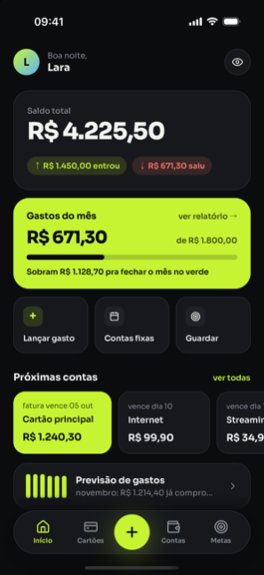
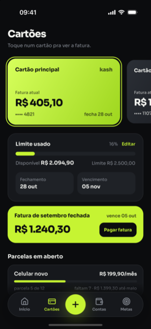
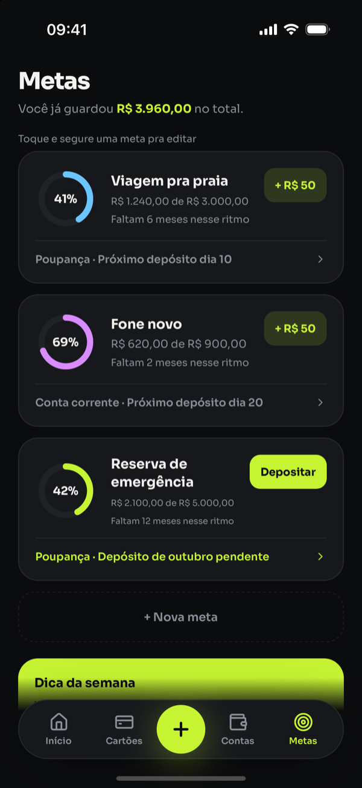
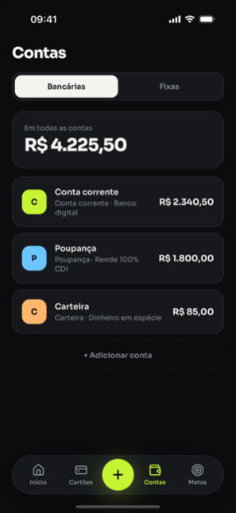
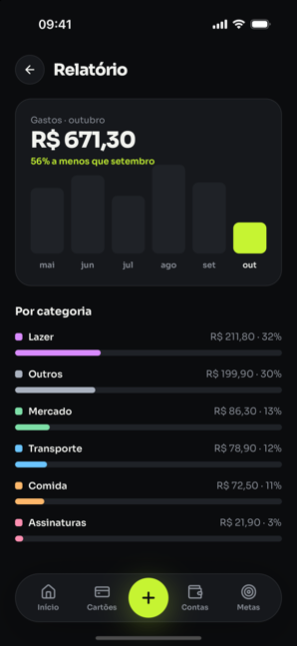
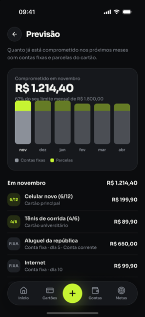
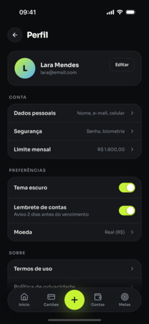
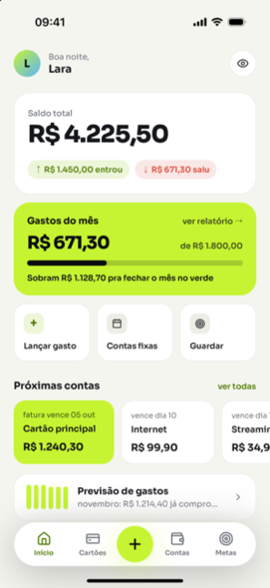

# Kash

**Sua grana, sem mistério.** App de finanças pessoais para quem tem entre 15 e 30 anos: cartões, contas e boletos num lugar só, lançamento de gasto em 3 toques e uma resposta clara para "quanto sobra até o fim do mês".

[](https://github.com/Loureiro12/kash/actions/workflows/ci.yml)


<table>
  <tr>
    <td align="center"><br><sub>Início</sub></td>
    <td align="center"><br><sub>Lançar gasto</sub></td>
    <td align="center"><br><sub>Cartões e fatura</sub></td>
    <td align="center"><br><sub>Metas</sub></td>
  </tr>
  <tr>
    <td align="center"><br><sub>Contas</sub></td>
    <td align="center"><br><sub>Relatório</sub></td>
    <td align="center"><br><sub>Previsão</sub></td>
    <td align="center"><br><sub>Perfil</sub></td>
  </tr>
  <tr>
    <td align="center"><br><sub>Onboarding</sub></td>
    <td align="center"><br><sub>Login</sub></td>
    <td align="center"><br><sub>Tema claro</sub></td>
    <td></td>
  </tr>
</table>

---

## Sumário

- [Funcionalidades](#funcionalidades)
- [Stack](#stack)
- [Começando](#começando)
- [Comandos](#comandos)
- [Estrutura do monorepo](#estrutura-do-monorepo)
- [Arquitetura](#arquitetura)
- [Regras de negócio](#regras-de-negócio)
- [Backend (Supabase)](#backend-supabase)
- [Testes](#testes)
- [Design system](#design-system)
- [Produção e release](#produção-e-release)
- [Documentação complementar](#documentação-complementar)

## Funcionalidades

**Dinheiro do dia a dia**
- Saldo total, entradas e saídas do mês, com opção de esconder os valores.
- Limite mensal de gastos com barra de progresso e "quanto sobra pra fechar o mês no verde".
- Lançamento de gasto ou entrada pelo botão central: teclado numérico próprio, categoria, origem (cartão ou conta), descrição e data.
- Lista completa de lançamentos por mês, com filtros, edição e exclusão com "Desfazer".

**Cartões de crédito**
- Fatura atual, limite usado e disponível, datas de fechamento e vencimento.
- Compras parceladas, inclusive **compras antigas**: informe o mês da 1ª parcela e o app calcula quais já foram pagas e lança só as que faltam.
- Virada de mês automática: fecha a fatura, avisa e permite "Pagar fatura" debitando uma conta.

**Contas e compromissos**
- Contas bancárias, poupança e carteira com saldo calculado.
- Contas fixas (aluguel, internet, assinaturas) cobradas em conta ou cartão; marcar como paga gera o lançamento.
- Previsão dos próximos 6 meses com o que já está comprometido em contas fixas e parcelas: tocar num mês mostra o total dele, a divisão, quanto sobra do limite e o acumulado até ali.

**Metas**
- Progresso em anel, aporte mensal, dia do depósito e conta onde o dinheiro fica guardado.
- Lembrete quando o depósito do mês está pendente.

**Categorias**
- Cada usuário tem a própria lista: cria, renomeia, troca a cor e exclui em Perfil › Categorias.
- Renomear atualiza lançamentos, contas fixas e parcelamentos; excluir uma categoria em uso pede para onde mover os registros.

**Conta e privacidade**
- Cadastro, login, alterar senha e **recuperação de senha por código** enviado por e-mail.
- Sessão criptografada no aparelho e desbloqueio com Face ID, Touch ID ou digital.
- Tema escuro e claro, lembretes por notificação local, relatório por categoria.
- Exportar todos os dados em JSON e excluir a conta pelo próprio app.
- Cor de cartão e conta escolhida pelo usuário, com seletor de cor completo.

## Stack

| Camada | Tecnologia |
|---|---|
| App | React Native 0.86 · Expo SDK 57 · TypeScript · Expo Router |
| Estado | Zustand (cache normalizada) · TanStack Query (snapshot do servidor, persistido) |
| UI | Design system próprio · Reanimated 4 · react-native-svg · Lucide · fonte Sora |
| Backend | Supabase: Postgres com RLS, Auth, RPCs em SQL, Edge Function (Deno), `pg_cron` |
| Testes | Vitest · Jest + Testing Library · pgTAP · Deno test · Maestro (E2E) |
| Monorepo | pnpm workspaces · Turborepo |
| Entrega | EAS Build, EAS Submit e EAS Update · GitHub Actions |

## Começando

**Pré-requisitos**
- Node 20+ e pnpm 10 (`corepack enable`).
- Xcode com simulador iOS e/ou Android Studio com emulador.
- Docker Desktop aberto, para o Supabase local.
- [Supabase CLI](https://supabase.com/docs/guides/cli) e, para E2E, o [Maestro](https://docs.maestro.dev/getting-started/installing-maestro).

**Primeira vez**

```bash
pnpm install
pnpm db:start                                  # sobe o Supabase local (Docker)
cp apps/mobile/.env.example apps/mobile/.env   # preencha com `supabase status -o env`
pnpm ios                                       # gera o dev client e abre no simulador
```

Depois do primeiro build, basta `pnpm dev` para subir o Metro. Entre com a usuária de demonstração **`lara@email.com` / `123456`**, criada pelo seed do banco local.

> O app usa módulos nativos (Reanimated, SVG, notificações, compartilhamento), então roda em **dev build**, não no Expo Go. Mudou dependência nativa ou plugin no `app.json`? Rode `npx expo prebuild --clean` e `pnpm ios` de novo.

**Variáveis de ambiente** (`apps/mobile/.env`, fora do git)

| Variável | Para que serve |
|---|---|
| `EXPO_PUBLIC_SUPABASE_URL` | URL do Supabase (local: `http://127.0.0.1:54321`) |
| `EXPO_PUBLIC_SUPABASE_ANON_KEY` | chave pública do projeto |
| `EXPO_PUBLIC_DATA_SOURCE` | `seed` roda só com dados de demonstração em memória, sem backend |
| `EXPO_PUBLIC_LOG_REQUESTS` | `1` imprime cada requisição ao Supabase no terminal do Metro |

## Comandos

Todos na raiz do repositório.

| Comando | O que faz |
|---|---|
| `pnpm ios` / `pnpm dev` | build nativo no simulador / só o Metro |
| `pnpm dev:web` · `pnpm e2e:web` | site em http://localhost:3000 / Playwright do site |
| `pnpm dev:prod` | Metro apontando para a **produção**, com log de requisições (lê `apps/mobile/.env.prod`) |
| `pnpm typecheck` · `pnpm lint` | TypeScript e ESLint em todos os pacotes |
| `pnpm test` | testes unitários: domínio (Vitest) e app (Jest) |
| `pnpm test:backend` | pgTAP + integração do client contra o Supabase local |
| `pnpm test:all` | os dois acima |
| `pnpm e2e:ios` | fluxos Maestro no simulador, com o banco resetado antes de cada um |
| `pnpm db:start` · `db:stop` · `db:reset` | ciclo de vida do Supabase local |
| `pnpm db:test` | só pgTAP |
| `pnpm db:types` | regenera os tipos do banco (a CI falha se houver diferença) |
| `pnpm deploy:backend` | migrações, Edge Function e config de auth no projeto de produção |

Antes de abrir PR: `pnpm typecheck && pnpm lint && pnpm test`, e `pnpm test:backend` se mexeu no banco.

## Estrutura do monorepo

```
apps/mobile/              app Expo
apps/web/                 site (Next.js): landing e política de privacidade; ver apps/web/README.md
  app/                    rotas (Expo Router): (auth) e (app) protegidas por estado de auth
  src/design-system/      tokens, tema e ~30 componentes; não conhece o domínio
  src/features/<área>/    telas e sheets: home, cards, accounts, goals, transactions, profile, auth…
  src/store/              Zustand (estado + ações) e hooks derivados consumidos pelas telas
  src/data/               TanStack Query, sincronização com o servidor e escritas otimistas
  src/services/           Supabase (sessão segura), notificações, log de requisições
  e2e/                    fluxos Maestro e runner com reset do banco
packages/domain/          @kash/domain: regras de negócio puras (sem React), testadas com Vitest
packages/supabase-client/ @kash/supabase-client: cliente tipado, repositórios, RPCs, erros, mappers
packages/config/          tsconfig base
supabase/                 migrações, seed, testes pgTAP, Edge Functions, templates de e-mail
docs/                     plano de integração, guia de release, screenshots
scripts/                  utilitários de deploy
```

## Arquitetura

As dependências apontam para um lado só:

```
app (rotas) → features (telas) → store / data → design-system
                                     ↓
                     @kash/supabase-client → @kash/domain
```

- **Regras no domínio.** Saldo, fatura, parcelas, orçamento, previsão, virada de mês e lembretes são funções puras em `packages/domain`. As telas só leem hooks de `src/store/hooks.ts`.
- **Servidor é a verdade, store é a cache.** Uma query carrega o snapshot do usuário e hidrata o Zustand. A cache da query é persistida, então o app abre com os últimos dados mesmo sem rede.
- **Escritas otimistas.** Cada ação aplica a mudança na hora e chama o repositório ou a RPC correspondente (`src/data/remoteActions.ts`). Dando certo ou não, o snapshot é refeito; erro vira toast e o estado volta ao do servidor.
- **Sheets globais** montados uma vez e controlados pelo store, com o botão principal fixo no rodapé, visível mesmo com o teclado aberto.
- **Relógio injetável** (`src/lib/clock.ts`) para congelar "hoje" nos testes.
- **Dinheiro** formatado por função própria (`formatBRL`), sem depender de `Intl`, e agregados arredondados a 2 casas.

## Regras de negócio

**Virada de mês.** Ao abrir o app, ao voltar ao primeiro plano e diariamente pelo `pg_cron`, a RPC `ensure_rollover` fecha a fatura do mês anterior de cada cartão, volta as contas fixas para "a pagar" e lança a próxima parcela de cada compra parcelada. O pagamento da fatura tem categoria `Fatura` e não conta como gasto, porque as compras já foram contadas ao entrar no cartão.

**Compras parceladas antigas.** Ao parcelar no cartão, o lançamento tem "1ª parcela em" (até 23 meses atrás) e "Valor digitado: Total ou Parcela". Com a 1ª parcela no passado, `installmentSchedule` calcula qual parcela cai neste mês. As anteriores contam como pagas e **não** viram lançamento, nem entram em fatura ou relatório. Só a parcela do mês é lançada, e a virada segue com as próximas. Uma compra já quitada não pode ser salva. O mês informado é o da fatura em que a parcela veio, então não depende do dia de fechamento do cartão.

**Excluir e mover parcelamentos.** Excluir "todas as parcelas" marca o parcelamento como excluído (`plans.deleted_at`): ele some de "Parcelas em aberto", a virada de mês não o relança e o "Desfazer" o restaura com o mesmo contador. Excluir "só esta parcela" não mexe no contador, e a próxima segue a numeração. Trocar o cartão de uma parcela move o parcelamento inteiro e as parcelas já lançadas (RPC `move_plan_to_card`); na edição de uma parcela, só cartões aparecem como origem.

**Face ID / biometria.** Em Perfil › Segurança, "Entrar com Face ID" (ou Touch ID/digital, conforme o aparelho) só liga depois de confirmar a biometria. Com ela ligada, o app abre trancado (`AppLock`) e pede a biometria depois da splash e ao voltar de mais de 30 s em segundo plano; "Entrar com senha" encerra a sessão. A preferência é deste aparelho (`src/services/biometrics.ts`, AsyncStorage): não sincroniza com o servidor e é desligada no logout. Sem biometria cadastrada, a tela explica e leva aos Ajustes.

**Lembretes.** `planReminders` monta a lista de notificações locais: contas fixas e faturas 2 dias antes do vencimento às 9h, dia de depósito das metas e "faturas fecharam" no dia 1º. O app reagenda sempre que os dados mudam e só com a permissão concedida no switch "Lembrete de contas".

**Recuperação de senha.** O e-mail traz um código (6 dígitos no local, 8 no projeto hospedado) que o usuário digita na tela "Esqueci a senha". O código vira uma sessão de recuperação, em que só a tela de nova senha existe. O mesmo e-mail mantém um deep link `kash://reset-password` como atalho.

**Categorias do usuário.** Ficam na tabela `categories` (nome único por usuário sem diferenciar maiúsculas, cor `#RRGGBB`, ordem). Todo usuário começa com as 6 padrão, criadas no cadastro. Lançamentos, contas fixas e parcelamentos guardam o nome; as RPCs `update_category` e `delete_category` renomeiam e movem os registros na mesma transação. "Entrada" e "Fatura" são reservadas ao sistema. A última categoria não pode ser excluída. No app, `useCategories` entrega a lista e o mapa de cores para chips, listas e relatório.

**Exportar e excluir.** "Exportar meus dados" chama a RPC `export_my_data` e abre a folha de compartilhamento com um JSON versionado (`kash-export/1`). "Excluir conta" chama a Edge Function `delete-account`, que apaga o usuário e todos os dados em cascata.

## Backend (Supabase)

- **Schema** em `supabase/migrations`: RLS por `auth.uid()` em todas as tabelas, `user_id` preenchido por padrão.
- **Saldos como views.** Saldo de conta é abertura mais lançamentos; uso do cartão é o mês corrente.
- **Escritas de várias linhas como RPCs:** `add_installment_purchase`, `pay_bill`, `pay_invoice`, `record_goal_deposit`, `soft_delete_transaction` e `undo_delete_transaction`, `delete_card`, `delete_account`, `ensure_rollover`, `export_my_data`, `update_category`, `delete_category`, `move_plan_to_card`.
- **Seed local** com a usuária Lara e ids fixos, usados pelos testes E2E.
- **Fuso único** America/Sao_Paulo para "hoje" e virada de mês.

## Testes

| Camada | Ferramenta | Onde |
|---|---|---|
| Regras de negócio | Vitest | `packages/domain/src/__tests__` |
| Componentes, telas, store, sincronização | Jest + Testing Library | `apps/mobile/src/**/__tests__` |
| Banco: RLS, RPCs, virada de mês | pgTAP | `supabase/tests` |
| Client contra o banco real | Vitest | `packages/supabase-client/tests` |
| Edge Function | `deno test` | `supabase/functions` |
| Ponta a ponta no app | Maestro (18 fluxos + roteiro de biometria) | `apps/mobile/e2e/flows` |
| Site | Vitest (conteúdo) + Playwright no celular e no desktop, com axe | `apps/web/tests` |

Os fluxos E2E cobrem onboarding e login, Início, lançar gasto à vista e parcelado, parcelamento antigo, cartões e fatura, contas, metas, páginas internas, editar e excluir, perfil e configurações, exportar dados, esqueci a senha com código, cores personalizadas, categorias e exclusão de conta. O runner reseta o banco antes de cada fluxo; detalhes em [`apps/mobile/e2e/README.md`](apps/mobile/e2e/README.md).

Todo elemento interativo tem `testID` em kebab-case (`tab-add`, `chip-cat-Comida`, `expense-first-month-prev`) e props de acessibilidade.

## Design system

- **Tokens são a única fonte** de cor, tipografia, espaço, raio, sombra e movimento (`src/design-system/tokens`). Telas nunca usam hex solto.
- **Temas escuro (padrão) e claro**, trocados em Perfil.
- **`Text` só aceita variantes da escala** tipográfica Sora.
- **Acessibilidade:** alvos de toque de 44 px ou mais, rótulos e estados em todos os controles, campos de senha com botão de mostrar e ocultar.
- **Cores personalizadas** em cartões e contas: além das cores prontas, a bolinha "Personalizar" abre o `ColorPickerModal` (área de saturação e brilho, barra de matiz, sugestões e código hex; a tecla retorno confirma). Para cartões, `cardAppearance` gera o gradiente a partir da cor e escolhe o texto claro ou escuro pelo contraste WCAG. A cor do cartão fica em `cards.color` (nula = gradiente pronto) e a da conta em `accounts.color`, ambas validadas como `#RRGGBB` no banco.
- **Valores em dinheiro** usam `MoneyInput`: o usuário digita só números, que entram pelos centavos, e o campo mostra o valor já formatado (`R$ 1.234,56`). Com `allowNegative`, um botão ± troca o sinal, usado no saldo da conta. O lançamento de gasto tem teclado próprio com a mesma lógica.
- **Movimento:** sheets em 300 ms, barras e anéis em 400 ms, haptics leves em ações.
- **Ícone e splash** em `apps/mobile/assets/brand`. A splash animada fica em `src/features/splash/AnimatedSplash.tsx`.

## Produção e release

| | |
|---|---|
| Identificador | `com.andreloureiro.kash` (iOS e Android) |
| Supabase | projeto `kash`, migrações aplicadas pela CI em todo push na `main` que mude `supabase/**` |
| Builds | EAS Build, perfis `development`, `preview` e `production` em `apps/mobile/eas.json` |
| Distribuição | TestFlight (App Store Connect) e Google Play, via EAS Submit |
| Atualizações | EAS Update no canal `production`, `runtimeVersion` igual à versão do app |

**Só JS mudou?** Publique um update:

```bash
cd apps/mobile
eas update --branch production --environment production --message "o que mudou"
```

**Mudou algo nativo?** Gere e envie um build novo:

```bash
eas build -p ios --profile production --non-interactive --no-wait
eas submit -p ios --latest --non-interactive
```

Se a mudança inclui migração de banco, ela precisa estar em produção **antes** do update do app. O passo a passo completo está em [`docs/release.md`](docs/release.md).

## Documentação complementar

- [`docs/release.md`](docs/release.md): checklist de produção, Supabase, EAS e lojas.
- [`docs/plano-integracao-supabase.md`](docs/plano-integracao-supabase.md): decisões e fases da integração com o backend.
- [`apps/mobile/e2e/README.md`](apps/mobile/e2e/README.md): como rodar os E2E no iOS e no Android.
- [`apps/mobile/assets/brand/README.md`](apps/mobile/assets/brand/README.md): ícones e splash.
- [`AGENTS.md`](AGENTS.md): convenções para agentes de código.
